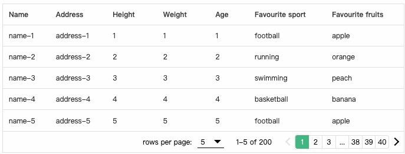
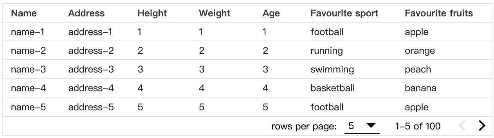
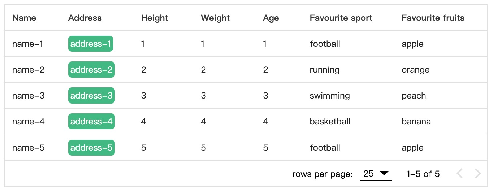
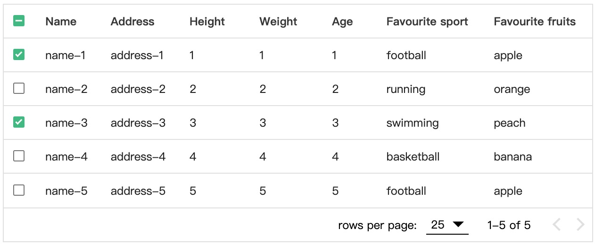
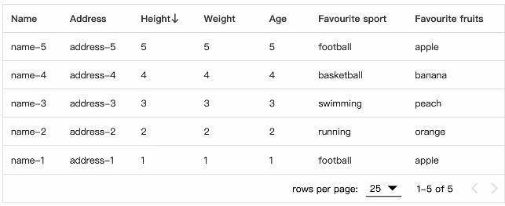
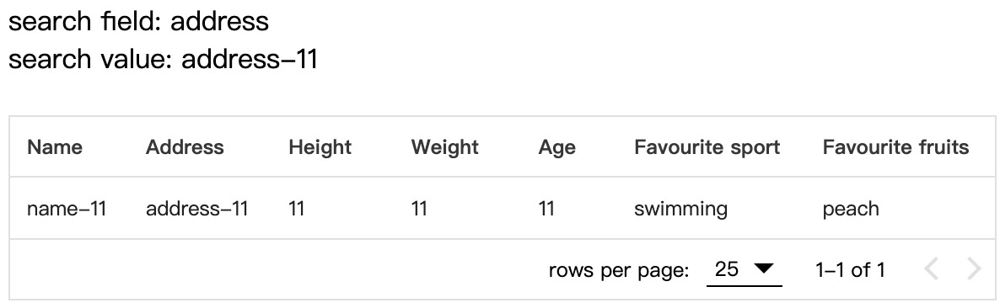
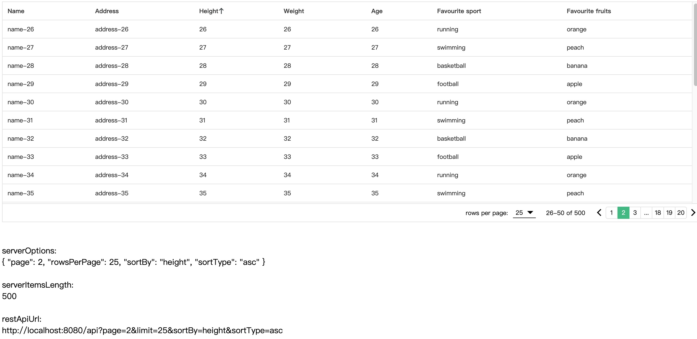
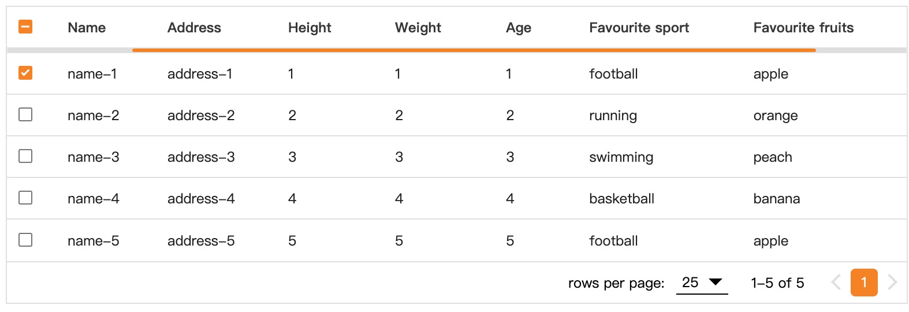

<p align="center">

</p>

## Introduction
vue3-easy-data-table is a simple and easy-to-use data table component made with Vue.js 3.x. The data table component in Vuetify 3 hasn't been released yet, so i made this component by referring to the API and UI of data table component in Vuetify 2.

## Getting started
### Install
```js
npm install vue3-easy-data-table
// or
yarn add vue3-easy-data-table
```

### Regist
```js
import Vue3EasyDataTable from 'vue3-easy-data-table';
import 'vue3-easy-data-table/dist/style.css';

const app = createApp(App);
app.component('EasyDataTable', Vue3EasyDataTable);
```

### Use
```js
<template>
  <EasyDataTable
    :headers="headers"
    :items="items"
  />
</template>

<script lang="ts">
import type { Header, Item } from "vue3-easy-data-table";

export default defineComponent({
  setup() {
    const headers: Header[] = [
      { text: "Name", value: "name" },
      { text: "Height (cm)", value: "height", sortable: true },
      { text: "Weight (kg)", value: "weight", sortable: true },
      { text: "Age", value: "age", sortable: true }
    ];

    const items: Item[] = [
      { "name": "Curry", "height": 178, "weight": 77, "age": 20 },
      { "name": "James", "height": 180, "weight": 75, "age": 21 },
      { "name": "Jordan", "height": 181, "weight": 73, "age": 22 }
    ];

    return {
      headers,
      items
    };
  },
});
</script>
```

## Modes
vue3-easy-data-table has two modes: `client` mode and `server side` mode. Client mode is for the case that all data has already been loaded, In other words, your initial call is asking for all the pages from a server. And In server side mode, you need to request limited data from a server everytime you navigate to a new page. Client mode is the default mode, you have to pass `server-options` and `server-items-length` props to switch to the server side mode.

## Features
1. [Buttons pagination](#buttons-pagination)
2. [Dense](#dense)
3. [Item slot](#item-slot)
4. [Multiple selecting](#multiple-selecting)
5. [Single field sorting](#single-field-sorting)
6. [Searching](#searching)
7. [Server side paginate and sort](#server-side-paginate-and-sort)
8. [Theme color](#theme-color)

## Buttons pagination
Use `buttons-pagination` prop and seven visible page buttons will be generated automatically to help you navigate much easier.



[Online preview](https://rfc8kw.csb.app/)

[](https://codesandbox.io/s/buttons-pagination-rfc8kw?file=/src/App.vue:125-150)


## Dense
Use `dense` prop to provide an alternate dense style.



[Online preview](https://7sjib3.csb.app/)

[](https://codesandbox.io/s/dense-7sjib3?file=/src/App.vue)

## Item slot
You can customize only certain columns like this:
```js
  <EasyDataTable :headers="headers" :items="items">
    <template #address="{ address }">
      <EasyButton :address="address" />
    </template>
  </EasyDataTable>
```
Notice that the `<name>` of `#<name>` should be a value of header item.



[Online preview](https://65tc9v.csb.app/)

[](https://codesandbox.io/s/item-slot-65tc9v?file=/src/App.vue)

## Multiple selecting
Using the `v-model:items-selected` will enable you to get data of specific items by toggling checkbox.



[Online preview](https://bhe0r9.csb.app/)

[](https://codesandbox.io/s/multiple-selecting-bhe0r9?file=/src/App.vue)

## Single field sorting
Add `sortable` property into the header items to make the corresponding columns sortable.
```js
 const headers: Header[] = [
  { text: "Height", value: "height", sortable: true },
  ...
 ];
```
Use `sort-by` and `sort-type` to define the initial sorting field and sorting type ('asc' or 'desc').



[Online preview](https://rjniui.csb.app/)

[](https://codesandbox.io/s/single-field-sorting-rjniui?file=/src/App.vue)

## Searching
Use `search-field` and `search-value` props to search for information in a specific field. If you don't pass the `search-field` prop, the component will search in all fields.

notice: Searching feature is only available in client mode.



[](https://codesandbox.io/s/searching-8egujm?file=/src/App.vue)

## Server side paginate and sort
Also called server-side mode, In this mode, you’re loading data already paginated and sorted from server. You should watch the `serverOptions` to know when to request new pages from server. Don't forget to use the `loading` prop to display a loading bar while fetching data.

`server-items-length` and `v-model:server-options` are required in this mode.



[Online preview](https://mif1nr.csb.app/)

[](https://codesandbox.io/s/server-side-paginate-and-sort-mif1nr?file=/src/App.vue)

## Theme color
Use `theme-color` prop to customize color of checkbox, active option of rows selector, loading bar and  active button of buttons pagination.



[](https://codesandbox.io/s/theme-color-89ps64?file=/src/App.vue)


# Props
## Common props
common props can be used both in client mode and server side mode.

| Name | Required | Type | Default | Description |
| -------- | ----------- | ---- | -------- | ------- |
| v-model: itemsSelected | false | Item[]<br>(Item:  Record<string, any>) | undefined | Items selected|
| body-font-color | false | string | '#212121' | Font color of table body|
| body-font-size | false | number | 12 | Font size of table body, including foot pagination |
| border-color | false | string | '#e0e0e0' | Border color |
| buttons-pagination | false | boolean | false | By default, you can only use prev and next buttons to navigate. But if you set the value to true, Seven visible page buttons will be generated automatically to help you navigate much easier |
| dense | false | boolean | false | Set true to decrease the height of rows|
| empty-message | false | string | 'No Available Data' | Message to display when there is no data in table|
| fixed-header | false | boolean | true | Fixed header to top of table. NOTE: Does not work in IE11 |
| headers | true | Header[]<br>Header: <br>{<br>  text: string,<br>  value: string,<br>  sortable?: boolean,<br>}<br>  | [] | Table header items |
| header-background-color | false | string | '#fff' | Background color of table head |
| header-font-color | false | string | '#373737' | Font color of table head |
| items | true | Item[] <br>(Item:  Record<string, any>) | [] | Table body items |
| loading | false | boolean | false | If true and no items are provided, then a loading bar and loading message will be shown |
| loading-message | false | string | 'Loading, please wait.' | Message shown when loading is true and no items are provided |
| max-height | false | number | 400 | Max height of table (table header and table body, not including footer pagination) |
| rows-items | false | number[] | [25, 50, 100] | A number array of rows-per-page, working as the options of `rows per page` selector |
| rows-per-page | false | number | 25 | Rows of items to display in per page |
| theme-color | false | string | '#42b883' | Fill color of checkbox, background color of active option of rows selector, color of loading bar and  background color of active button of buttons pagination |


### Client mode Props 
#### only available in client mode
| Name | Required | Type | Default | Description |
| -------- | ----------- | ---- | -------- | ------- |
| search-field | false | string | '' | A specific field in which you search for information. (**the value of search field should be a value of header item, not text of header item**). If you don't pass a specific field, the component will search in all fields.|
| search-value | false | string | '' | Search value |
| sort-by | false | string | '' | A specific field for sorting |
| sort-type | false | 'asc' \| 'desc'| 'asc' | Order by 'asc' or 'desc' when sorting|


### Server side mode props 
#### only available in server side mode
| Name | Required | Type | Default | Description |
| -------- | ----------- | ---- | -------- | ------- |
| v-model:server-options | true | ServerOptions: <br>{<br> page?: number,<br> rowsPerPage?: number,<br> sortBy?: string,<br> sortType?: 'asc' \| 'desc',<br>} | {} | An object which can be used as values of parameters in a pagination REST API such as:<br>`http://localhost:8080/api?page=${ServerOptions.page}&limit=${ServerOptions.rowsPerPage}&sortBy=${ServerOptions.sortBy}&sortType=${ServerOptions.sortType}`|
| server-items-length | true | number | undefined | Total amount of items available on server |

## Todo
This component just satisfied my needs, if you find any bug or demand any other features, plese report an issue and making pull requests is very welcomed.
