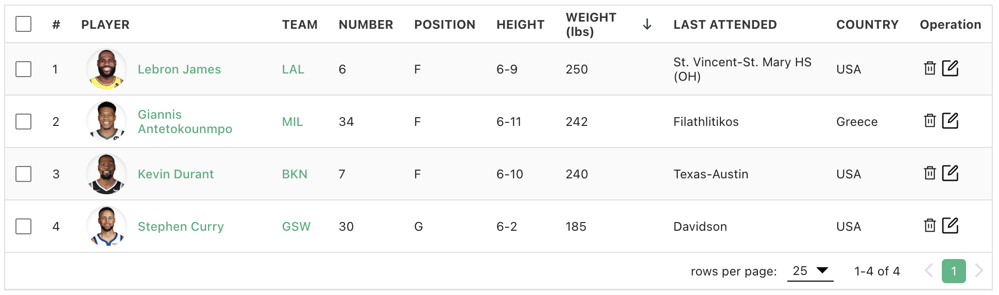

<p align="center">

</p>

## Introduction
vue3-easy-data-table is a customizable and easy-to-use data table component made with Vue.js 3.x.

## Website
https://hc200ok.github.io/vue3-easy-data-table-doc/



## Features
1. [Item slot](https://hc200ok.github.io/vue3-easy-data-table-doc/features/item-slot.html)
2. [Buttons pagination](https://hc200ok.github.io/vue3-easy-data-table-doc/features/buttons-pagination.html)
3. [Multiple selecting](https://hc200ok.github.io/vue3-easy-data-table-doc/features/multiple-selecting.html)
4. [Pagination slot](https://hc200ok.github.io/vue3-easy-data-table-doc/features/pagination-slot.html)
5. [Single field sorting](https://hc200ok.github.io/vue3-easy-data-table-doc/features/single-field-sorting.html)
6. [Searching](https://hc200ok.github.io/vue3-easy-data-table-doc/features/searching.html)
7. [Server side paginate and sort](https://hc200ok.github.io/vue3-easy-data-table-doc/features/server-side-paginate-and-sort.html)
8. [Loading slot](https://hc200ok.github.io/vue3-easy-data-table-doc/features/loading-slot.html)
9. [Footer customization](https://hc200ok.github.io/vue3-easy-data-table-doc/features/footer-customization.html)
10. [Filtering](https://hc200ok.github.io/vue3-easy-data-table-doc/features/filtering.html) (new feature since version `1.2.3`)
11. [Click row](https://hc200ok.github.io/vue3-easy-data-table-doc/features/click-row.html) (new feature since version `1.2.4`)
12. [Column width](https://hc200ok.github.io/vue3-easy-data-table-doc/features/column-width.html) (new feature since version `1.2.10`)
13. [Fixed columns](https://hc200ok.github.io/vue3-easy-data-table-doc/features/fixed-column.html) (new feature since version `1.2.10`)
14. [Header slot](https://hc200ok.github.io/vue3-easy-data-table-doc/features/header-slot.html) (new feature since version `1.2.25`)
15. [Expand slot](https://hc200ok.github.io/vue3-easy-data-table-doc/features/expand-slot.html) (new feature since version `1.3.2`)
16. [Style customization](https://hc200ok.github.io/vue3-easy-data-table-doc/features/style-customization.html) (new feature since version `1.3.11`)
17. [Border cell](https://hc200ok.github.io/vue3-easy-data-table-doc/features/border-cell.html) (new feature since version `1.3.11`)
18. [Class name customization](https://hc200ok.github.io/vue3-easy-data-table-doc/features/class-name-customization.html) (new feature since version `1.3.11`)

## Getting started
### 1. ES module
#### Install
```js
npm install vue3-easy-data-table
// or
yarn add vue3-easy-data-table
```

#### Regist
```js
import Vue3EasyDataTable from 'vue3-easy-data-table';
import 'vue3-easy-data-table/dist/style.css';

const app = createApp(App);
app.component('EasyDataTable', Vue3EasyDataTable);
```

#### Use
```js
<template>
  <EasyDataTable
    :headers="headers"
    :items="items"
  />
</template>

<script lang="ts">
import type { Header, Item } from "vue3-easy-data-table";

export default defineComponent({
  setup() {
    const headers: Header[] = [
      { text: "Name", value: "name" },
      { text: "Height (cm)", value: "height", sortable: true },
      { text: "Weight (kg)", value: "weight", sortable: true },
      { text: "Age", value: "age", sortable: true }
    ];

    const items: Item[] = [
      { "name": "Curry", "height": 178, "weight": 77, "age": 20 },
      { "name": "James", "height": 180, "weight": 75, "age": 21 },
      { "name": "Jordan", "height": 181, "weight": 73, "age": 22 }
    ];

    return {
      headers,
      items
    };
  },
});
</script>
```

### 2. CDN:
```html
<link href="https://unpkg.com/vue3-easy-data-table/dist/style.css" rel="stylesheet">
<script src="https://cdn.jsdelivr.net/npm/vue@3.2.1/dist/vue.global.js"></script>
<script src="https://unpkg.com/vue3-easy-data-table"></script>

<div id="app">
  <easy-data-table
    :headers="headers"
    :items="items"
  />
</div>

<script>
  const App = {
    components: {
      EasyDataTable: window['vue3-easy-data-table'],
    },
    data () {
      return {
        headers:[
          { text: "Name", value: "name" },
          { text: "Height (cm)", value: "height", sortable: true },
          { text: "Weight (kg)", value: "weight", sortable: true },
          { text: "Age", value: "age", sortable: true }
        ],
        items: [
          { "name": "Curry", "height": 178, "weight": 77, "age": 20 },
          { "name": "James", "height": 180, "weight": 75, "age": 21 },
          { "name": "Jordan", "height": 181, "weight": 73, "age": 22 }
        ],
      }
    },
  };
  Vue.createApp(App).mount('#app');
</script>
```

## Todo
1. Refactory.
3. Make table header customizable 🎛️.
4. Vitual table rows.
5. Mobile responsive.

## Contribution
Shout out to the people who made new feature requests and reported issues to make this component better.
